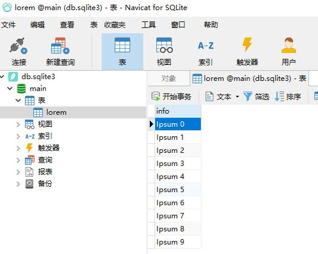
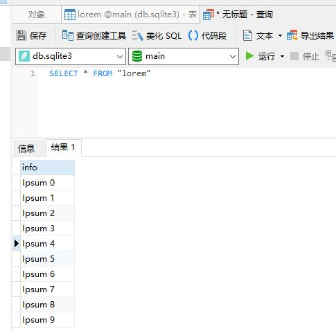

# 001_getting_started

官方示例，详见 https://github.com/mapbox/node-sqlite3#usage 。

> 需要先在根目录中执行 `npm install` 命令。

## 1. 官方原始例子

官方的例子中，数据库文件是存在内存中的，因此虽然新建了一个数据库，且写入了数据，但是看不到数据库文件。

在本目录中执行以下命令

```shell
node index
```

则将输出以下结果：

```text
1: Ipsum 0
2: Ipsum 1
3: Ipsum 2
4: Ipsum 3
5: Ipsum 4
6: Ipsum 5
7: Ipsum 6
8: Ipsum 7
9: Ipsum 8
10: Ipsum 9
```

## 2. 生成数据库文件

在官方示例基础上，输出一个数据库文件 `db.sqlite3`。相关差别请查看文档说明 https://github.com/mapbox/node-sqlite3/wiki/API#new-sqlite3databasefilename-mode-callback 。

使用 SQLite 的可视化工具加载之后，可以看到里面的内容和结构。

> 下图是使用 [navicat-for-sqlite](http://www.navicat.com.cn/products/navicat-for-sqlite) 的截图。



如果允许 SQL 语句，则也可以看到结果


